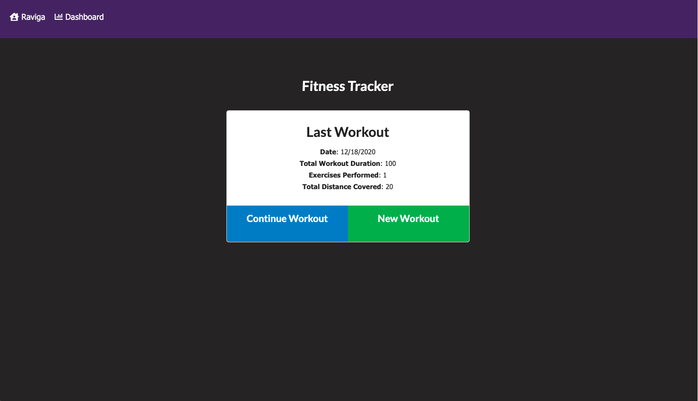
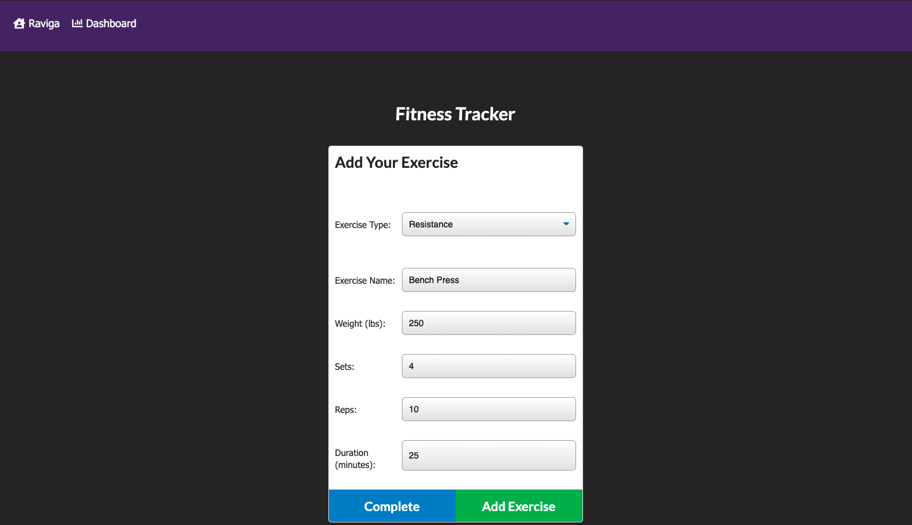
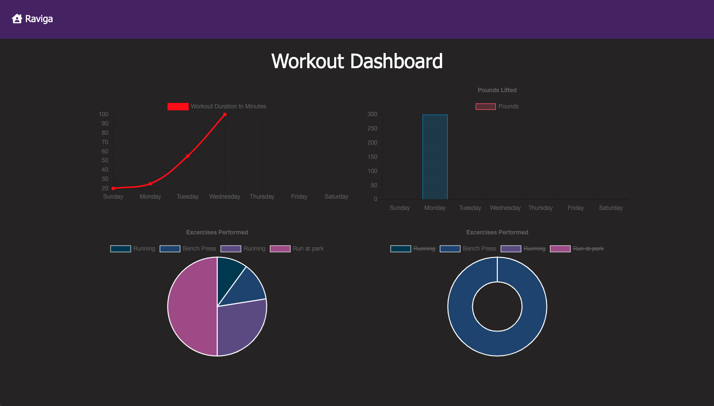

# Raviga Fitness Tracker
     

An application used to log and track workouts in order for the user to reach their fitness goals. Built with JavaScript, Node, Express, Mongoose, and MongoDB.

View the deployed application <a href = "https://desolate-chamber-67784.herokuapp.com/">here</a>

## Table of Contents
* [Installation](#installation)
* [Usage](#usage)
* [Resources](#resources)
* [Contributions](#contributions)
* [Testing](#testing)
* [Questions](#questions)
* [License](#license)


## Installation

If you would like to use the application in your local environment: 
1. Clone the repo
2. Install required dependencies by running command ```npm i```
3. Edit ```server.js``` file to match your MongoDb database name
4. Run command ```node server``` to get started

Otherwise, visit the deployed application <a href = "https://desolate-chamber-67784.herokuapp.com/">here</a>

## Usage
#### View Last Workout


#### New Workout/Add Exercise


#### View Stats



## Resources
**Node.js** <br>
**MongoDb** <br>
**Express** <br>
**Bootstrap** <br>
**Mongoose** <br>
**Font Awesome** <br>


## Contributions
All contributions to this project are welcome!  Clone down the repo to your local machine, commit changes, push to GitHub, and open a pull request!

## Testing
No tests are set up for Raviga at this time.  Feel free to write tests or search the application for bugs.

## Questions
If you have any further questions, feel free to reach out to me! <br>
<a href='https://www.github.com/twkirkpatrick'>Github</a> <br>
<a href='mailto:twk4491@gmail.com'>twk4491@gmail.com</a>

## License
Usage is provided under the MIT license.

